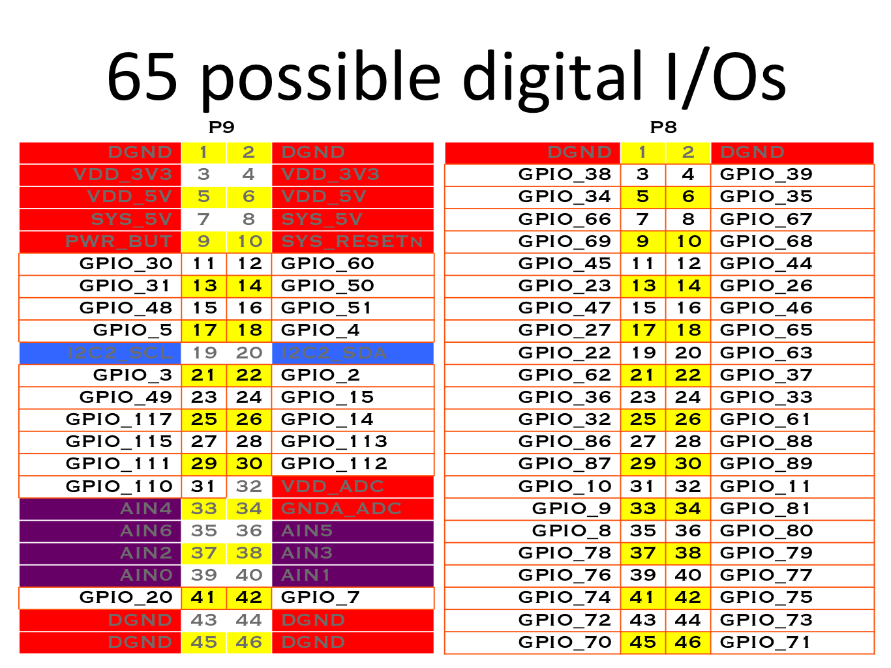

.. _dyOKyfdhsh:

=======================================
SBC/Beaglebone
=======================================

Software
=======================================
#. `Production Images <https://rcn-ee.com/rootfs/>`_
#. `Testing Images <https://rcn-ee.com/rootfs/bb.org/testing/>`_
#. `Kernel Sources <https://github.com/beagleboard/linux>`_
#. `Device Tree Overlays <https://github.com/beagleboard/bb.org-overlays/>`_

Hardware
=======================================

Header References
---------------------------------------

.. figure:: _include/images/beagle_bone_header.png
    :scale: 25 %

.. figure:: _include/images/beagle_bone_headers_pwm.png
    :scale: 25 %

.. figure:: _include/images/beagle_bone_headers_serial.png
    :scale: 25 %

.. figure:: _include/images/beagle_bone_headers_pru.png
    :scale: 25 %

Input/Output (IO)
---------------------------------------

ADC
~~~~~~~~~~~~~~~~~~~~~~~~~~~~~~~~~~~~~~~

* 12 Bit
* 125 ns sample time
* 0-1.8V
* 2uA sample current
* Overlays: BB-ADC
* Sysfs Path: /sys/bus/iio/devices/iio:device0

.. warning:: Vmax on ADC is 1.8V

GPIO
~~~~~~~~~~~~~~~~~~~~~~~~~~~~~~~~~~~~~~~
* 3.3 V
* Source 6mA, Sink 8 mA [2]_
* Pins limited to sourcing 4mA: P9_19, P9_20, P9_24, P9_26, P9_41, P9_24
* Internal Pullup/down resistors: 25K
* Sysfs path: /sys/class/gpio

.. note::

    * GPIO number matches the export number under /sys/class/gpio.
    * EX: GPIO_66 = echo 66 > /sys/class/gpio/export

**Default Configurations:**

.. list-table::
    :header-rows: 1

    * - Header Pin
      - Pin Name
      - PU/PD
    * - P8_7
      - GPIO_66
      - PU
    * - P8_8
      - GPIO_67
      - PU
    * - P8_9
      - GPIO_69
      - PU
    * - P8_10
      - GPIO_68
      - PU
    * - P8_11
      - GPIO_45
      - PD
    * - P8_12
      - GPIO_44
      - PD
    * - P8_15
      - GPIO_47
      - PD
    * - P8_16
      - GPIO_46
      - PD
    * - P8_17
      - GPIO_27
      - PD
    * - P8_18
      - GPIO_65
      - PD

PWM
~~~~~~~~~~~~~~~~~~~~~~~~~~~~~~~~~~~~~~~
* xyz

Timers
~~~~~~~~~~~~~~~~~~~~~~~~~~~~~~~~~~~~~~~
* xyz

Busses
---------------------------------------

I2C
~~~~~~~~~~~~~~~~~~~~~~~~~~~~~~~~~~~~~~~
* Overlays: BB-I2C1, BB-I2C2

.. note::

    * I2C-0 is not exposed on headers
    * I2C-1 conflicts with SPI-0
    * External pullups required on SDA & SCL

.. figure:: _include/images/beagle_bone_headers_i2c.png
    :scale: 25 %

.. list-table::
    :header-rows: 2

    * -
      - I2C1
      - I2C1
      - I2C2
      - I2C2
    * - Signal
      - Number
      - Name
      - Number
      - Name
    * - SCL
      - P9_17
      - SPI0_CS0
      - P9_19
      - I2C2_SCL
    * - SDA
      - P9_18
      - SPI0_D1
      - P9_20
      - I2C2_SDA

SPI
~~~~~~~~~~~~~~~~~~~~~~~~~~~~~~~~~~~~~~~

* Overlays: BB-SPIDEV-0, BB-SPIDEV1

.. note:: SPI-0 conflicts with I2C-1

.. figure:: _include/images/beagle_bone_headers_spi.png
    :scale: 25 %

.. list-table::
    :header-rows: 2

    * -
      - SPI0
      - SPI0
      - SPI1
      - SPI1
    * - Signal
      - Number
      - Name
      - Number
      - Name
    * - SCLK
      - P9_22
      - spi0_sclk
      - P9_31
      - spi1_sclk
    * - MOSI
      - P9_18
      - spi0_d1
      - P9_30
      - spi1_d1
    * - MISO
      - P9_21
      - spi0_do
      - P9_29
      - spi1_d0
    * - CS0
      - P9_17
      - spi0_cs0
      - P9_28
      - spi1_cs0
    * - CS1
      -
      -
      -
      -

UART
~~~~~~~~~~~~~~~~~~~~~~~~~~~~~~~~~~~~~~~
* xyz

Community
=======================================

Accessories
=======================================

References
=======================================
#. `BeagleBone: open-hardware expander computer <http://beagleboard.org/support/bone101>`_
#. `Maximum current on GPIO <https://groups.google.com/d/msg/beagleboard/cWGCEtg9syY/ZRDfAxRctfMJ>`_
